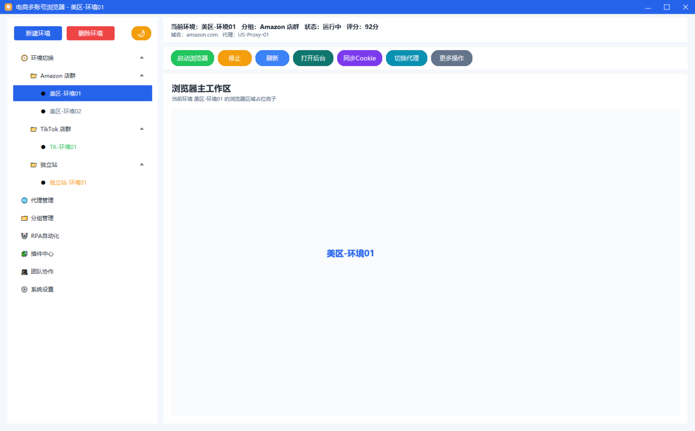
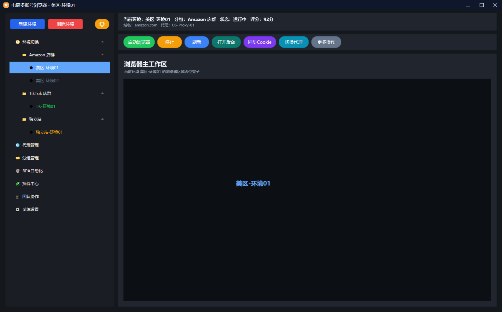

# MultiAccountCommerce

基于 `emoji_window.dll` 的电商多账号浏览器界面草图示例仓库，当前整理了三套可直接查看或运行的版本：

- `Python/`：Python 版界面草图
- `Csharp/`：C# 版界面草图，目录内同时提供源码与可直接运行的 EXE
- `E/`：易语言版本源码与对应 DLL

项目目标是把同一套“电商多账号浏览器”界面方案，分别落地到不同技术栈，方便后续继续扩展为真实业务界面。

## 界面预览

### 截图 1



### 截图 2



## 目录结构

```text
MultiAccountCommerce/
├─ Csharp/
│  ├─ Program.cs
│  ├─ EcommerceWorkspaceSketchApp.cs
│  ├─ EmojiWindowNative.cs
│  ├─ EmojiWindowEcommerceWorkspaceSketchDemo.csproj
│  ├─ EmojiWindowEcommerceWorkspaceSketchDemo.exe
│  ├─ emoji_window.dll
│  └─ favicon.ico
├─ Python/
│  ├─ demo_env_workspace_sketch.py
│  ├─ emoji_window.dll
│  └─ favicon.ico
├─ E/
│  ├─ 电商多账号浏览器UI.e
│  └─ emoji_window.dll
└─ img/
   ├─ 1.png
   └─ 2.png
```

## 运行说明

### Python 版本

目录：`Python/`

要求：

- Windows
- 64 位 Python 3
- `emoji_window.dll` 与脚本放在同一目录

运行：

```bash
cd Python
python demo_env_workspace_sketch.py
```

说明：

- 当前脚本会优先从当前目录读取 `emoji_window.dll` 和 `favicon.ico`
- 复制到其他位置时，只要 DLL 和图标跟脚本放一起即可直接运行

### C# 版本

目录：`Csharp/`

要求：

- Windows
- .NET Framework 4.8
- `emoji_window.dll` 与 EXE 放在同一目录

直接运行：

```text
Csharp/EmojiWindowEcommerceWorkspaceSketchDemo.exe
```

如果需要重新编译源码：

```bash
cd Csharp
msbuild EmojiWindowEcommerceWorkspaceSketchDemo.csproj /p:Configuration=Debug /p:Platform=x64
```

说明：

- 目录内已包含现成 EXE，可直接运行
- 目录内也保留了完整源码，便于继续开发

### 易语言版本

目录：`E/`

说明：

- `电商多账号浏览器UI.e` 为易语言版本源码
- `emoji_window.dll` 已一并放入目录
- 使用易语言打开工程后，保证 DLL 与程序在同目录即可调试或运行

## 当前功能

当前界面草图主要包含：

- 左侧树形环境切换
- Amazon / TikTok / 独立站分组示例
- 右侧环境信息区
- 工具栏按钮区
- 浏览器工作区占位区
- 明暗主题切换

当前主要是 UI 草图与交互骨架，还没有接入真实浏览器内核、多账号隔离、代理管理、Cookie 同步等业务能力。

## 依赖说明

本仓库运行依赖核心 DLL：

- `emoji_window.dll`
  开源地址：<https://github.com/mosheng20205/emoji-ui-dll>

为了保证复制后即可运行，Python、C#、易语言目录内都分别放置了各自需要的 DLL 文件。

## 备注

如果后续同步到 GitHub，建议补充：

- 根目录 `.gitignore`
- Python 版本依赖说明
- C# 版本构建环境说明
- 更完整的功能路线图

目前这份 README 已可直接作为仓库首页说明使用。

